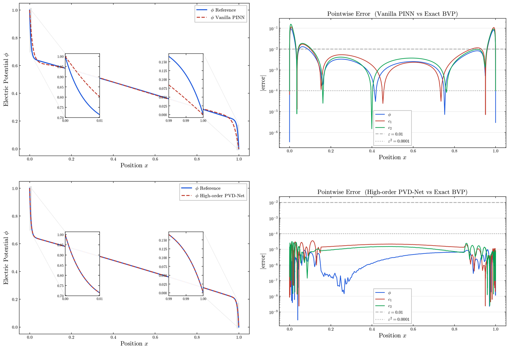

# PVD-Net for Singularly Perturbed Poisson–Nernst–Planck Systems

Code for the paper

> H. Jin, S. Ji, J. Zu. *A Multi-Scale Neural Network Method for Solving Singularly Perturbed Steady-State Poisson–Nernst–Planck Systems.* Submitted.

PVD-Net (Prandtl–Van Dyke Neural Network) solves the steady-state Poisson–Nernst–Planck (PNP) system in the singularly perturbed regime ε ≪ 1, where thin boundary layers form at both ends of the channel. Instead of fitting the solution with a single network, PVD-Net represents the terms of a matched asymptotic expansion: separate networks learn the outer solution and the inner (boundary-layer) solutions in the stretched variables ξ = x/ε and η = (x−1)/ε, the Prandtl or Van Dyke matching conditions enter the loss, and the ion fluxes J_k are learnable parameters. The global solution is reconstructed from the composite expansion. Since the loss functions do not involve ε, the training problem is the same for every ε.



*Setting A (1:−1 valences), ε = 10⁻². Top: Vanilla PINN misses both boundary layers, with pointwise errors up to 10⁻¹. Bottom: High-order PVD-Net with the same number of parameters and collocation points, with pointwise errors of order 10⁻⁵. The insets magnify the layers x ∈ [0, 0.01] and x ∈ [0.99, 1].*

Three variants are provided:

| Variant | Expansion | Networks | Training |
|---|---|---|---|
| Leading-order PVD-Net | zeroth order, Prandtl matching | 3 | joint |
| High-order PVD-Net | first order, Van Dyke matching | 8 | joint |
| Staged PVD-Net | first order, Van Dyke matching | 8 | zeroth order → first order (zeroth order frozen) → joint |

Four PINN-based methods are included for comparison, all at about 37,000 trainable parameters: Vanilla PINN, AA-PINN (adaptive activation), C-PINN (Chien's composite expansion) and BL-PINN (boundary-layer PINN).

PVD-Net was originally proposed for scalar singularly perturbed ODEs; that code is available at [PVD-ONet-for-singularly-perturbed-problems](https://github.com/zuj100/PVD-ONet-for-singularly-perturbed-problems).

## Results


*Setting D: three ion species (Ca²⁺, Na⁺, Cl⁻), a non-uniform channel h(x) = 1 − 0.2 sin(πx) and a permanent charge Q ≡ −0.15, ε = 10⁻². High-order PVD-Net against the reference solution. Going from two to three species changes only the output dimensions of the networks, not the architecture.*


*Error of φ in Setting A for ε from 10⁻¹ to 10⁻⁴, split into the asymptotic truncation error E_asym, which involves no network, and the network error E_net. E_asym follows the predicted slopes O(ε) for Leading-order PVD-Net (left) and O(ε²) for High-order PVD-Net (right). E_net does not deteriorate as ε decreases, and the total error settles at E_net once the truncation error falls below it.*

## Repository structure

```
.
├── 0.Exp_PINN/       Vanilla PINN for ε = 1, 0.1, 0.01, 0.001
├── 1.Exp_A/          Setting A: 1:−1 valences
├── 2.Exp_B/          Setting B: 2:−1 valences
├── 3.Exp_C/          Setting C: relaxed electroneutrality
├── 4.Exp_D/          Setting D: three species, non-uniform channel, permanent charge
├── 5.Exp_Var_eps/    ε-dependence and error decomposition (Setting A)
└── images/           Figures used in this README
```

Folders 1–4 contain the same seven notebooks, with `X` ∈ {A, B, C, D}:

| Notebook | Method |
|---|---|
| `PVDNet_X_0th.ipynb` | Leading-order PVD-Net |
| `PVDNet_X_1st.ipynb` | High-order PVD-Net |
| `PVDNet_X_Staged.ipynb` | Staged PVD-Net |
| `PINN_X.ipynb` | Vanilla PINN |
| `AAPINN_X.ipynb` | AA-PINN |
| `CPINN_X.ipynb` | C-PINN |
| `BLPINN_X.ipynb` | BL-PINN |

Folder 5 contains `PVDNet_Leading_EpsSweep.ipynb`, `PVDNet_High_EpsSweep.ipynb` and `PVDNet_Staged_EpsSweep.ipynb`, each of which trains one model for every ε ∈ {10⁻¹, 10⁻², 10⁻³, 10⁻⁴} and splits its error into the asymptotic truncation error and the network error.

Correspondence with the paper:

| Folder | Paper |
|---|---|
| `0.Exp_PINN` | Section 4.1, Table 1, Fig. 4 |
| `1.Exp_A` | Section 4.2, Table 3, Fig. 5 |
| `2.Exp_B` | Section 4.3, Table 4 |
| `3.Exp_C` | Section 4.4, Table 5 |
| `4.Exp_D` | Section 4.5, Table 6, Fig. 6 |
| `5.Exp_Var_eps` | Section 4.6, Tables 8–9, Fig. 7, Appendix B |

Parameter counts (Table 2) and training times (Table 7) are printed in the notebooks of folders 1–4.

## Problem settings

All experiments use ε = 10⁻² and V = 1. L and R are the bath concentrations at x = 0 and x = 1.

| Setting | Valences | h(x) | Q | L | R | Training steps (Staged: stages 1 + 2 + 3) |
|---|---|---|---|---|---|---|
| A | (1, −1) | 1 | 0 | (1.0, 2.0) | (1.5, 1.0) | 1.5×10⁵ (5×10⁴ + 5×10⁴ + 5×10⁴) |
| B | (2, −1) | 1 | 0 | (1.0, 1.5) | (2.5, 1.0) | 3×10⁵ (5×10⁴ + 5×10⁴ + 2×10⁵) |
| C | (1, −1) | 1 | 0 | (0.8, 2.4) | (1.2, 1.8) | 3×10⁵ (5×10⁴ + 5×10⁴ + 2×10⁵) |
| D | (2, 1, −1) | 1 − 0.2 sin(πx) | −0.15 | (0.5, 1.0, 1.5) | (3.0, 4.5, 4.0) | 3×10⁵ (1×10⁴ + 1×10⁴ + 2.8×10⁵) |

Setting C corresponds to the relaxation parameters σ = 1/3 and ρ = 2/3. Within each setting, all methods use the same number of training steps.

## Requirements

- Python 3.9 (folders 0–4) or Python 3.12 (folder 5)
- PyTorch, NumPy, SciPy, Matplotlib, Jupyter

```bash
pip install torch numpy scipy matplotlib jupyter
```

For a CUDA build of PyTorch, use the selector at [pytorch.org](https://pytorch.org/get-started/locally/). A GPU is recommended; the notebooks fall back to the CPU automatically if none is found. The results in the paper were obtained on an NVIDIA GeForce RTX 4070.

## Usage

Open a notebook and run all cells. Each notebook is self-contained and needs no data files: it defines the problem, builds and trains the networks, computes the reference solution of the full PNP system with `scipy.integrate.solve_bvp` (tolerance 10⁻⁸; by continuation in ε for Setting D), evaluates the five error metrics of the paper on a grid refined inside the boundary layers, and plots the results.

The problem parameters are set in a single cell; search for `eps = 1e-2`.

The outputs of the runs reported in the paper are kept in the notebooks, so the results can be inspected without re-running. On an RTX 4070, one notebook takes between about 0.4 h (Vanilla PINN, Setting A) and 5 h (High-order PVD-Net, Setting D). Each ε-sweep notebook trains four models and takes about 3.7 h (Leading), 6.6 h (Staged) or 8.1 h (High).

## Notes

- **Random seeds.** The notebooks of Setting D and of the ε sweep fix the random seed (`SEED = 0`). Those of Settings A–C do not, so re-running them gives numbers that differ slightly from the paper.
- **Saved figures.** Figures are written as PDF and PNG to the working directory. The three ε-sweep notebooks all write `eps_scaling.pdf` and `eps_scaling.png`, so running them in the same folder overwrites these files.
- **Repeated runs.** The last section of the notebooks in folders 1–4 contains a loop over five fixed seeds. It is stored as a Markdown cell and is not executed; change the cell type to Code to run it.
- **Language.** Comments, Markdown text and printed output in the notebooks are partly in Chinese.

## Citation

If you use this code, please cite:

```bibtex
@article{jin2026pvdnet,
  title   = {A Multi-Scale Neural Network Method for Solving Singularly Perturbed Steady-State {Poisson--Nernst--Planck} Systems},
  author  = {Jin, Haoran and Ji, Shuguan and Zu, Jian},
  note    = {Submitted},
  year    = {2026}
}
```

## License

This project is released under the MIT License; see [LICENSE](LICENSE).

## Contact

Jian Zu (corresponding author), School of Mathematics and Statistics, Northeast Normal University: zuj100@nenu.edu.cn
